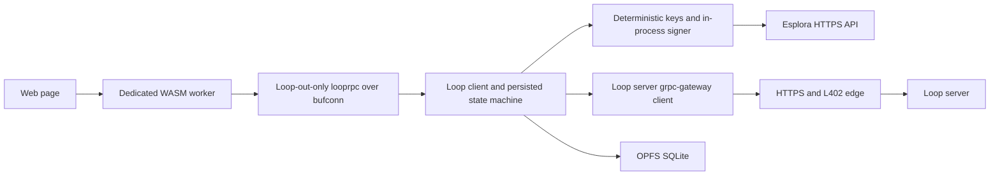

# Browser WASM Loop Out

This package supports the first browser milestone: create a Loop Out, let an
external Lightning wallet pay the invoices, and sweep the server-funded HTLC
to an external Bitcoin address. The page does not connect to an LND process
and does not tunnel native sockets through WebSocket or WebTransport.

The embedded wallet still reuses LND's Go signing and transaction primitives.
"No LND" in this design means that no LND daemon, channel database, Lightning
wallet, or native RPC connection is present. Removing the LND Go module itself
is a separate refactor and is not required by the lightweight-wallet model.

## Runtime boundary



Only two remote origins are needed:

- The Loop server's authenticated HTTPS origin, for terms, quotes, swap
  creation, updates, preimage push, cancellation, and cooperative signing.
- An Esplora HTTPS origin, for chain tip, fee estimates, transaction lookup,
  confirmation and spend polling, and transaction broadcast.

The server transport reuses the configured gRPC-Gateway. It posts proto JSON
to the existing unbound method paths, such as
`/looprpc.SwapServer/LoopOutTerms`, and decodes the gateway's streamed JSON
envelopes. This project does not add another server listener or HTTP adapter.
The browser runtime labels its proto JSON request bodies as `text/plain`, a
CORS-safelisted content type accepted by the gateway's wildcard JSON
marshaler. This keeps an unauthenticated request simple and leaves only the
`Authorization` header to approve when an authenticated request is
preflighted. The reusable REST client otherwise defaults to
`application/json`. The deployed edge must allow the page origin and the
`Authorization` request header, expose `WWW-Authenticate`, and avoid buffering
streaming responses.

The local `looprpc.SwapClient` connection uses `bufconn`. It is an internal
API boundary between the JavaScript-facing SDK and the embedded Loop runtime;
it never opens a listening TCP port.

## Browser package and API

Run `make wasm-loop` to build a flat, same-origin asset set in `bin/wasm`:

- `loop-wasm.wasm` and its gzip variant;
- the matching Go `wasm_exec.js`;
- the go-wasmsqlite bridge, worker, SQLite JavaScript, WASM, and OPFS proxy;
  and
- `loop-wasm-worker.js`, the outer classic worker that owns the Go runtime.

Serve the WASM file as `application/wasm`. Browser deployments also need
cross-origin isolation, normally `Cross-Origin-Opener-Policy: same-origin`,
`Cross-Origin-Embedder-Policy: require-corp`, and
`Cross-Origin-Resource-Policy: same-origin`. The page should verify
`crossOriginIsolated` and `SharedArrayBuffer` before starting the worker.

The worker accepts `{id, method, request}` messages. Startup requires the
database name, hex wallet seed, Bitcoin network, Esplora origin, and existing
Loop server gRPC-Gateway origin:

```js
const loop = new Worker("loop-wasm-worker.js");
loop.postMessage({
  id: 1,
  method: "start",
  request: {
    database_path: "loop-browser.db",
    seed: walletSeedHex,
    network: "testnet4",
    esplora_url: "https://esplora.example",
    loop_server_url: "https://loop.example",
    poll_interval_ms: 5000,
  },
});
```

Unary method aliases are `loopOutTerms`, `loopOutQuote`, `loopOut`,
`listSwaps`, `swapInfo`, and `getInfo`. Their request and response objects use
the generated `looprpc` proto JSON field names. The full generated method
names, such as `looprpc.SwapClient.LoopOut`, are also accepted. Send
`method: "monitor"` to receive a `started` reply followed by stream `event`
replies, and send `{id, cancel: true}` to close that stream. `stop` shuts down
the in-process runtime.

## Payment flow

A normal Loop Out creates two Lightning payment requests: a main swap invoice
and a smaller prepay invoice. The browser must present both. A deployment may
also issue a separate L402 invoice the first time the page authenticates.

```mermaid
sequenceDiagram
    participant UI as Browser UI
    participant Loop as Embedded Loop
    participant Payer as External Lightning wallet
    participant Server as Loop server
    participant Chain as Esplora and Bitcoin

    UI->>Loop: Request terms and quote
    Loop->>Server: HTTPS proto JSON
    UI->>Loop: Start external-payment Loop Out
    Loop->>Server: Create swap
    Server-->>Loop: Swap invoice and prepay invoice
    Loop-->>UI: Both invoices and swap ID
    UI->>Payer: Pay both invoices
    Server->>Chain: Publish funded HTLC
    Loop->>Chain: Poll script confirmation
    Loop->>Server: Reveal preimage
    Loop->>Chain: Broadcast cooperative or script-path sweep
    Chain-->>Loop: Sweep confirmation
    Loop-->>UI: Success
```

External-payment mode is persisted before swap creation returns. On restart,
Loop displays the same invoices and resumes the on-chain state machine without
calling `SendPayment`, `TrackPayment`, or any channel API.

## Embedded wallet

`internal/browserwallet` implements the Loop Out subset of the current
`lndclient.LndServices` boundary:

- LND-compatible deterministic key paths and durable next-key indexes.
- ECDSA, Taproot script-path, and MuSig2 signing in process.
- Esplora fee estimation and transaction broadcast.
- Esplora-backed block, confirmation, reorganization, and spend watches.

The adapter deliberately fails if the external-payment path tries to pay or
track a Lightning invoice. The external destination also avoids address
generation, wallet balance, coin selection, and transaction funding calls.

## L402 bootstrap

Paying an L402 invoice is different from displaying the two swap invoices.
The page must receive the payment preimage so it can construct and persist the
authorization header. A QR payment made by an unrelated wallet does not
normally return that preimage to the page. Integrations should use one of:

- WebLN or Nostr Wallet Connect, returning the payment preimage;
- an explicit preimage return step from the payer; or
- a previously provisioned L402 authorization token.

The REST client exposes the challenge rather than silently invoking an LND
router. The resulting authorization state is stored in runtime SQLite and is
part of the recovery set. It is bound to the canonical gRPC-Gateway base URL;
the runtime refuses to send a recovered credential to another gateway.

The optional worker bridge is enabled with
`l402_payer: "loopWasmPayInvoice"` and a positive `l402_max_cost_sat`. It sends
the page a `{type: "l402_invoice", payment_id, invoice}` message. After WebLN,
NWC, or another integrated payer returns the payment preimage, the page sends:

```js
loop.postMessage({
  type: "l402_payment",
  payment_id: paymentID,
  preimage: paymentPreimageHex,
});
```

The embedded client verifies that the 32-byte preimage matches the invoice
before it persists the reusable authorization. Without a payer callback, the
first unpaid L402 challenge is returned to the caller.

## Persistence and recovery

The runtime uses OPFS-backed SQLite with a single database connection. Export
uses that connection to take a consistent SQL dump; database operations that
arrive during the dump wait for it to finish. A versioned recovery bundle
includes checksummed artifacts for:

- the Loop and sweep-batcher database;
- the wallet seed and key-index state;
- persistent L402 authorization; and
- network, schema, creation-time, and format metadata.

The bundle contains funds-bearing secrets, including the swap preimage and
wallet seed. Checksums detect corruption but do not provide secrecy or
authenticity. The application must encrypt and authenticate the complete
bundle before download or remote storage.

`exportRecovery` returns `{bundle, plaintext: true, warning}`. The `bundle`
value is deliberately plaintext so the host can encrypt it with its chosen
browser cryptography and key-management policy; it MUST NOT be downloaded or
uploaded as returned. The example page encrypts it with a passphrase-derived
AES-256-GCM key before offering a download.

Stop the runtime before calling `restoreRecovery`. Restore requires a fresh or
otherwise unused `database_path`, the expected `network`, the decrypted
`bundle`, and `fresh_target: true`. It refuses a target containing application
state, loads the dump, applies current migrations, verifies the network and
checksums, rederives every pending swap key, and records the seed commitment.
Only then does it return the recovered hex seed for a subsequent `start`.

## Browser lifecycle

A dedicated worker keeps cryptography, SQLite, and polling off the UI thread.
Use the Web Locks API to ensure that only one tab opens a profile's OPFS files.
A service worker is not a daemon host: browsers may stop it between events.
Pages and dedicated workers can also be frozen or discarded, so every pending
swap must resume from SQLite after reload.

The first end-to-end release gate should cover:

1. Reload before the server publishes the HTLC.
2. Reload after the HTLC confirms but before the sweep confirms.
3. Restore the encrypted bundle into a clean browser profile.
4. Cooperative sweep and script-path fallback.
5. Fee republish and a confirmation reorganization.
6. A browser network trace containing only HTTPS server and Esplora traffic,
   with no TCP bridge.

Loop In, asset swaps, instant swaps, internal destinations, and background
execution after the browser has suspended the page are outside this milestone.
