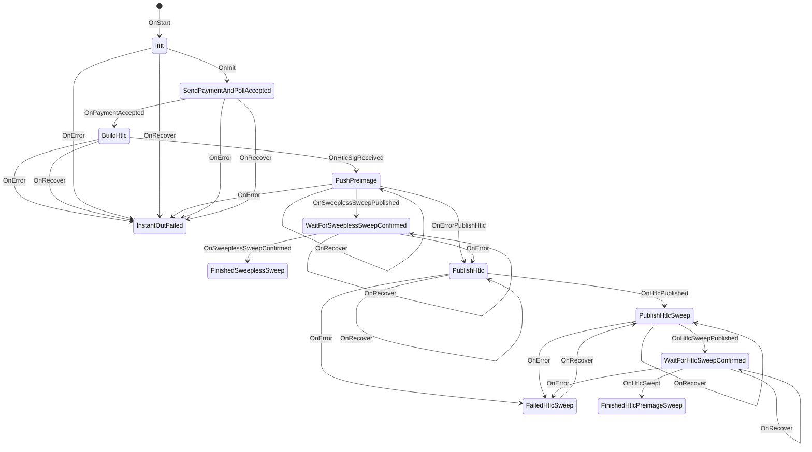

```mermaid
stateDiagram-v2
[*] --> Init: OnStart
BuildHtlc
BuildHtlc --> PushPreimage: OnHtlcSigReceived
BuildHtlc --> InstantOutFailed: OnError
BuildHtlc --> InstantOutFailed: OnRecover
FailedHtlcSweep
FailedHtlcSweep --> PublishHtlcSweep: OnRecover
FinishedHtlcPreimageSweep
FinishedSweeplessSweep
Init
Init --> InstantOutFailed: OnError
Init --> InstantOutFailed: OnRecover
Init --> SendPaymentAndPollAccepted: OnInit
InstantOutFailed
PublishHtlc
PublishHtlc --> PublishHtlc: OnRecover
PublishHtlc --> PublishHtlcSweep: OnHtlcPublished
PublishHtlc --> FailedHtlcSweep: OnError
PublishHtlcSweep
PublishHtlcSweep --> WaitForHtlcSweepConfirmed: OnHtlcSweepPublished
PublishHtlcSweep --> PublishHtlcSweep: OnRecover
PublishHtlcSweep --> FailedHtlcSweep: OnError
PushPreimage
PushPreimage --> WaitForSweeplessSweepConfirmed: OnSweeplessSweepPublished
PushPreimage --> InstantOutFailed: OnError
PushPreimage --> PublishHtlc: OnErrorPublishHtlc
PushPreimage --> PushPreimage: OnRecover
SendPaymentAndPollAccepted
SendPaymentAndPollAccepted --> BuildHtlc: OnPaymentAccepted
SendPaymentAndPollAccepted --> InstantOutFailed: OnError
SendPaymentAndPollAccepted --> InstantOutFailed: OnRecover
WaitForHtlcSweepConfirmed
WaitForHtlcSweepConfirmed --> FinishedHtlcPreimageSweep: OnHtlcSwept
WaitForHtlcSweepConfirmed --> WaitForHtlcSweepConfirmed: OnRecover
WaitForHtlcSweepConfirmed --> FailedHtlcSweep: OnError
WaitForSweeplessSweepConfirmed
WaitForSweeplessSweepConfirmed --> FinishedSweeplessSweep: OnSweeplessSweepConfirmed
WaitForSweeplessSweepConfirmed --> WaitForSweeplessSweepConfirmed: OnRecover
WaitForSweeplessSweepConfirmed --> PublishHtlc: OnError
```