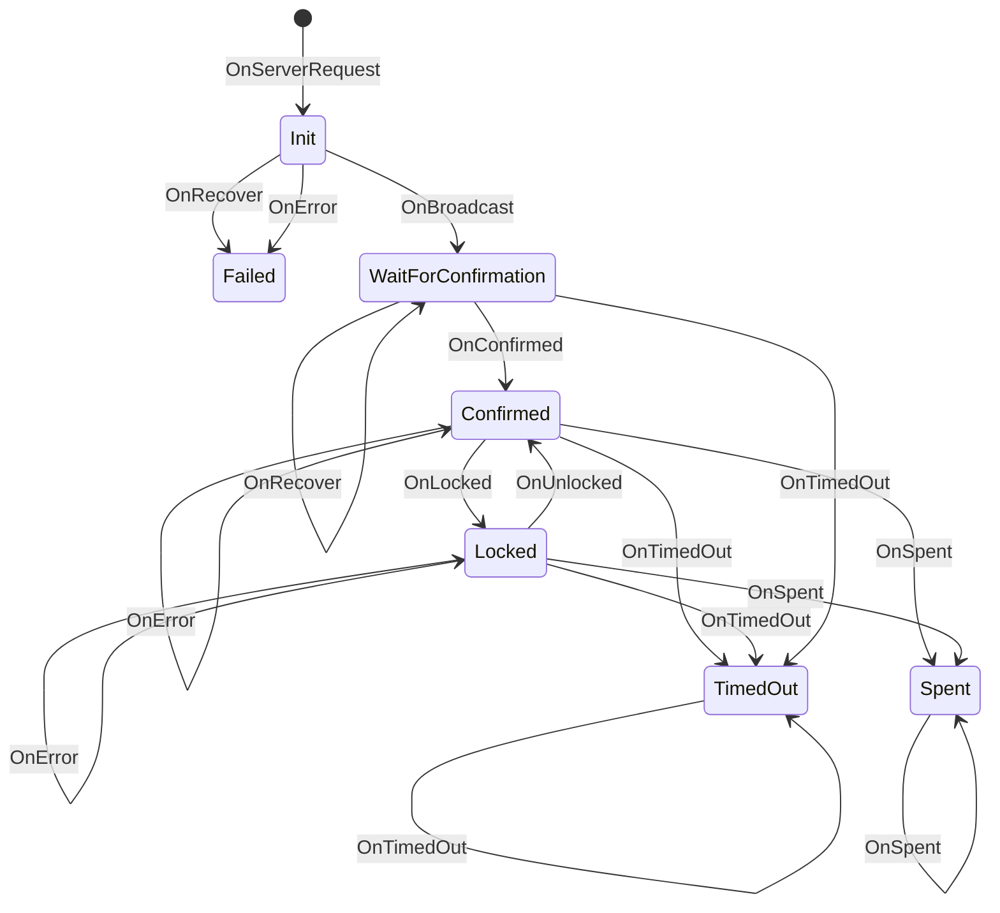

```mermaid
stateDiagram-v2
[*] --> Init: OnServerRequest
Confirmed
Confirmed --> Spent: OnSpent
Confirmed --> TimedOut: OnTimedOut
Confirmed --> Confirmed: OnRecover
Confirmed --> Locked: OnLocked
Confirmed --> Confirmed: OnError
Failed
Init
Init --> WaitForConfirmation: OnBroadcast
Init --> Failed: OnRecover
Init --> Failed: OnError
Locked
Locked --> Confirmed: OnUnlocked
Locked --> TimedOut: OnTimedOut
Locked --> Locked: OnRecover
Locked --> Spent: OnSpent
Locked --> Locked: OnError
Spent
Spent --> Spent: OnSpent
TimedOut
TimedOut --> TimedOut: OnTimedOut
WaitForConfirmation
WaitForConfirmation --> TimedOut: OnTimedOut
WaitForConfirmation --> WaitForConfirmation: OnRecover
WaitForConfirmation --> Confirmed: OnConfirmed
```