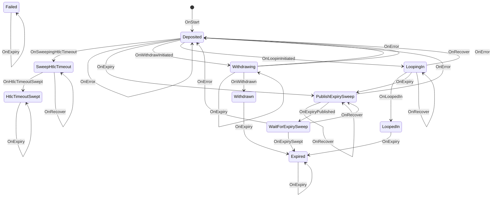

```mermaid
stateDiagram-v2
[*] --> Deposited: OnStart
Deposited
Deposited --> SweepHtlcTimeout: OnSweepingHtlcTimeout
Deposited --> Deposited: OnRecover
Deposited --> Deposited: OnError
Deposited --> PublishExpirySweep: OnExpiry
Deposited --> Withdrawing: OnWithdrawInitiated
Deposited --> LoopingIn: OnLoopinInitiated
Expired
Expired --> Expired: OnExpiry
Failed
Failed --> Failed: OnExpiry
HtlcTimeoutSwept
HtlcTimeoutSwept --> HtlcTimeoutSwept: OnExpiry
LoopedIn
LoopedIn --> Expired: OnExpiry
LoopingIn
LoopingIn --> LoopedIn: OnLoopedIn
LoopingIn --> PublishExpirySweep: OnExpiry
LoopingIn --> LoopingIn: OnLoopinInitiated
LoopingIn --> LoopingIn: OnRecover
LoopingIn --> Deposited: OnError
PublishExpirySweep
PublishExpirySweep --> PublishExpirySweep: OnRecover
PublishExpirySweep --> WaitForExpirySweep: OnExpiryPublished
PublishExpirySweep --> Deposited: OnError
SweepHtlcTimeout
SweepHtlcTimeout --> HtlcTimeoutSwept: OnHtlcTimeoutSwept
SweepHtlcTimeout --> SweepHtlcTimeout: OnRecover
WaitForExpirySweep
WaitForExpirySweep --> Expired: OnExpirySwept
WaitForExpirySweep --> PublishExpirySweep: OnRecover
WaitForExpirySweep --> Deposited: OnError
Withdrawing
Withdrawing --> Deposited: OnRecover
Withdrawing --> Withdrawing: OnExpiry
Withdrawing --> Deposited: OnError
Withdrawing --> Withdrawn: OnWithdrawn
Withdrawn
Withdrawn --> Expired: OnExpiry
```