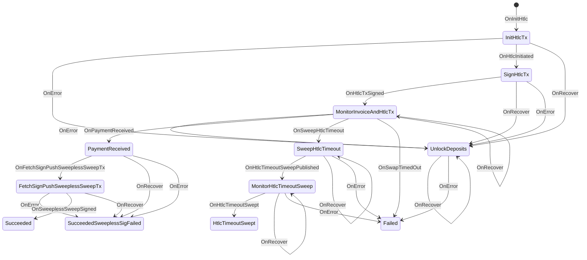

```mermaid
stateDiagram-v2
[*] --> InitHtlcTx: OnInitHtlc
Failed
FetchSignPushSweeplessSweepTx
FetchSignPushSweeplessSweepTx --> SucceededSweeplessSigFailed: OnError
FetchSignPushSweeplessSweepTx --> Succeeded: OnSweeplessSweepSigned
FetchSignPushSweeplessSweepTx --> SucceededSweeplessSigFailed: OnRecover
HtlcTimeoutSwept
InitHtlcTx
InitHtlcTx --> UnlockDeposits: OnError
InitHtlcTx --> SignHtlcTx: OnHtlcInitiated
InitHtlcTx --> UnlockDeposits: OnRecover
MonitorHtlcTimeoutSweep
MonitorHtlcTimeoutSweep --> HtlcTimeoutSwept: OnHtlcTimeoutSwept
MonitorHtlcTimeoutSweep --> MonitorHtlcTimeoutSweep: OnRecover
MonitorHtlcTimeoutSweep --> Failed: OnError
MonitorInvoiceAndHtlcTx
MonitorInvoiceAndHtlcTx --> UnlockDeposits: OnError
MonitorInvoiceAndHtlcTx --> PaymentReceived: OnPaymentReceived
MonitorInvoiceAndHtlcTx --> SweepHtlcTimeout: OnSweepHtlcTimeout
MonitorInvoiceAndHtlcTx --> Failed: OnSwapTimedOut
MonitorInvoiceAndHtlcTx --> MonitorInvoiceAndHtlcTx: OnRecover
PaymentReceived
PaymentReceived --> FetchSignPushSweeplessSweepTx: OnFetchSignPushSweeplessSweepTx
PaymentReceived --> SucceededSweeplessSigFailed: OnRecover
PaymentReceived --> SucceededSweeplessSigFailed: OnError
SignHtlcTx
SignHtlcTx --> MonitorInvoiceAndHtlcTx: OnHtlcTxSigned
SignHtlcTx --> UnlockDeposits: OnRecover
SignHtlcTx --> UnlockDeposits: OnError
Succeeded
SucceededSweeplessSigFailed
SweepHtlcTimeout
SweepHtlcTimeout --> MonitorHtlcTimeoutSweep: OnHtlcTimeoutSweepPublished
SweepHtlcTimeout --> SweepHtlcTimeout: OnRecover
SweepHtlcTimeout --> Failed: OnError
UnlockDeposits
UnlockDeposits --> UnlockDeposits: OnRecover
UnlockDeposits --> Failed: OnError
```